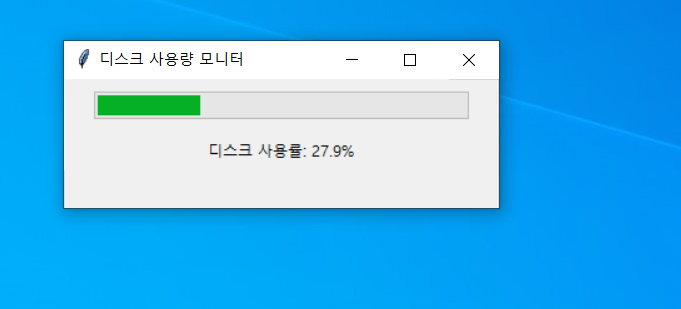

> 개요

윈도우 PC의 디스크를 관리하고 싶어서 다음과 같이 제작하게 되었습니다.

> 사용 라이브러리

-   tkinter
-   psutil

> 실행 방법

```python
  python thinker_disk.py
```

> 실행 화면



> 추후 예정

-   드라이브별 ( 사용중 / 여유 / 나머지 ) 용량 보여주기 ✔

> 문제 해결 모음집

https://today-gogo.tistory.com/3
